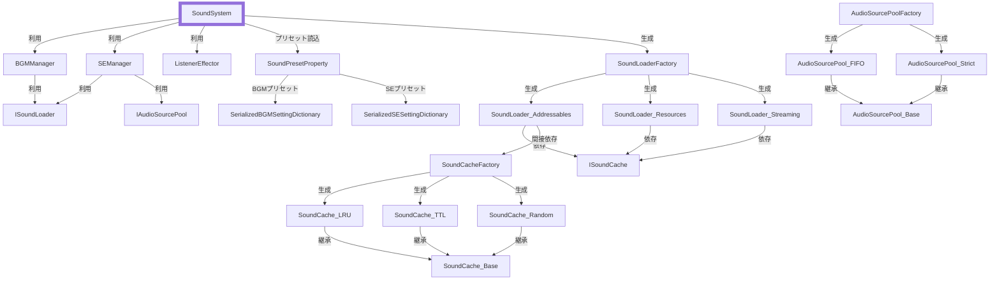

# SoundSystem for Unity

## 概要
Unity 上での BGM・SE 管理を一本化するためのライブラリです。プリセットによる設定管理、AudioSource プール、複数方式のキャッシュ、ログ出力などを備え、ゲーム内のサウンド制御をシンプルにします。

## 主な機能
- BGM 再生：FadeIn / FadeOut / CrossFade に対応
- SE 再生：AudioSource プールで効率的に管理（FIFO または Strict）、FadeIn / 全体フェードアウト対応
- SoundLoader：Addressables / Resources / Streaming から選択可能
- SoundCache：LRU / TTL / Random の削除方式を提供
- SoundPresetProperty：BGM・SE のプリセット設定を ScriptableObject として管理
- ListenerEffector：AudioListener へのフィルター適用・無効化
- オートエビクト：一定間隔でキャッシュを自動削除
- 使用中のサウンドはキャッシュから削除しない参照カウント機能
- オートディスポーズ：シーン変更時の自動解放を選択可能
- ロギング：Safe / Warn / Error の 3 段階でログファイルを出力

## 必要環境
- Unity 2023 以降
- UniTask
- Addressables（`USE_ADDRESSABLES` 定義時）

## 導入方法
1. UniTask と（必要に応じて）Addressables をプロジェクトに導入します。
2. 本リポジトリをビルドして生成される `SoundSystem.dll` を `Assets/Plugins` に配置します。
3. Addressables を利用する場合は Player Settings の `Scripting Define Symbols` に `USE_ADDRESSABLES` を追加します。

## 初期化例
### 手動構成
```csharp
var cache  = SoundCacheFactory.CreateLRU(30f);
var loader = SoundLoaderFactory.Create(SoundLoaderFactory.Type.Streaming, cache);
var pool   = AudioSourcePoolFactory.Create(
    AudioSourcePoolFactory.Type.FIFO,
    mixerGroup,
    initSize: 8,
    maxSize: 32);
var soundSystem = new SoundSystem(
    loader,
    cache,
    pool,
    listener,
    mixer,
    mixerGroup,
    persistent: true);
soundSystem.StartAutoEvict(60f);
```
### プリセット利用
```csharp
var soundSystem = SoundSystem.CreateFromPreset(
    preset,
    listener,
    mixer,
    persistent: true);
```

## 使い方
### BGM
```csharp
await soundSystem.PlayBGM("bgm_title", 1.0f);
await soundSystem.FadeInBGM("bgm_intro", 2.0f, 1.0f);
await soundSystem.CrossFadeBGM("bgm_battle", 2.0f);
await soundSystem.PlayBGMWithPreset("bgm_battle", "BattlePreset");
```
### SE
```csharp
await soundSystem.PlaySE("se_click", Vector3.zero, 1.0f, 1.0f, 1.0f);
await soundSystem.PlaySEWithPreset("se_explosion", "ExplosionPreset");
await soundSystem.FadeInSE("se_wind", 1.5f);
await soundSystem.FadeOutAllSE(1.0f);
await soundSystem.FadeInSEWithPreset("se_magic", "MagicPreset");
```
### Mixer パラメータ
```csharp
float? volume = soundSystem.RetrieveMixerParameter("MasterVolume");
soundSystem.SetMixerParameter("MasterVolume", -10.0f);
```
### エフェクト操作
```csharp
soundSystem.ApplyEffectFilter<AudioReverbFilter>(f => f.reverbLevel = 1000f);
soundSystem.DisableAllEffectFilter();
```

## システム構成


## 既存コードへの影響
`ISoundCache` に参照カウント用の `BeginUse` / `EndUse` が追加されました。
既存の実装クラスを利用している場合は、これらのメソッドを適宜呼び出す必要があります。

## ライセンス
本リポジトリは MIT ライセンスで公開されています。詳細は [LICENSE](LICENSE) を参照してください。
また、依存ライブラリの UniTask も MIT ライセンスで提供されています。第三者ライセンスの一覧は [THIRD-PARTY-LICENSE](THIRD-PARTY-LICENSE) を参照してください。
